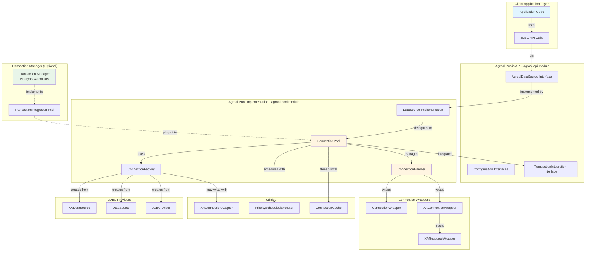
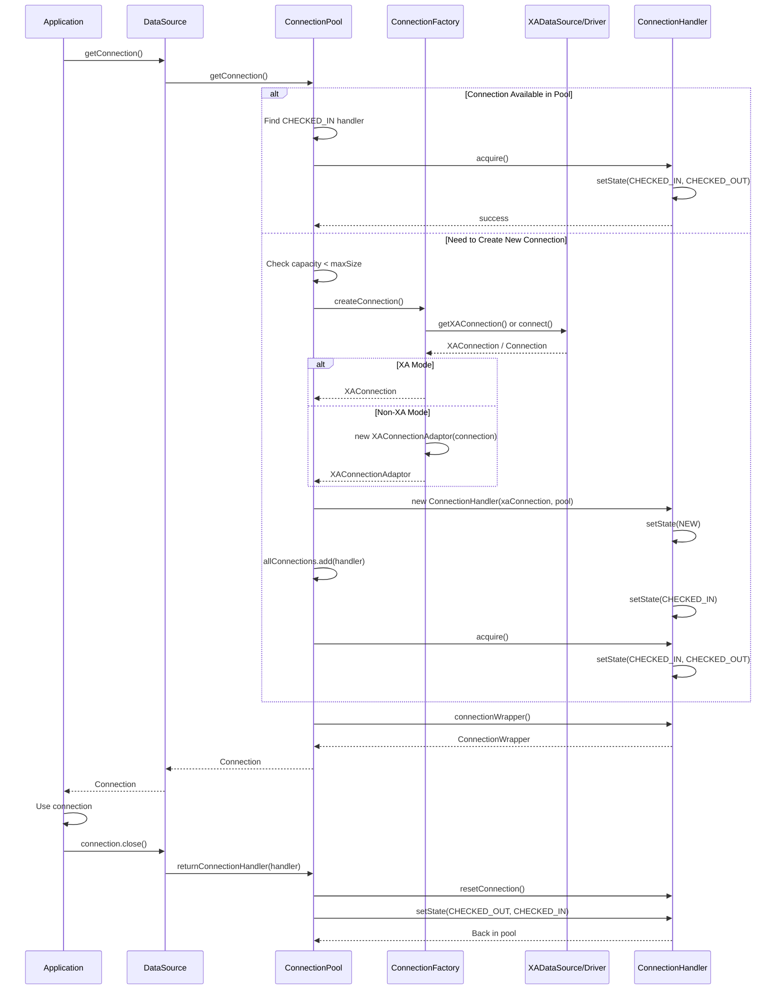
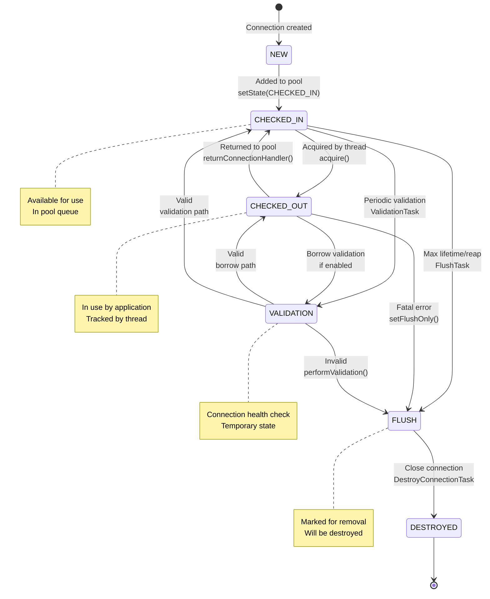
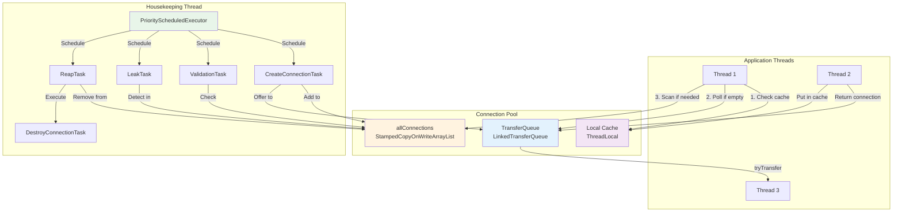
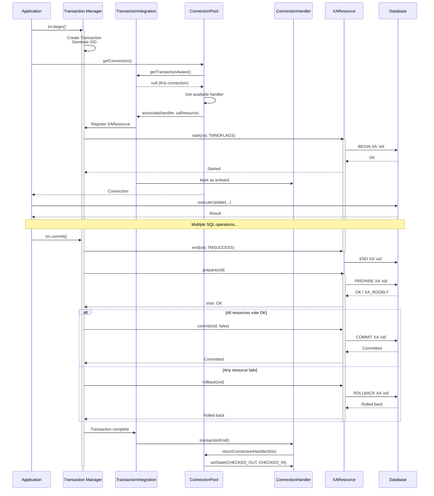
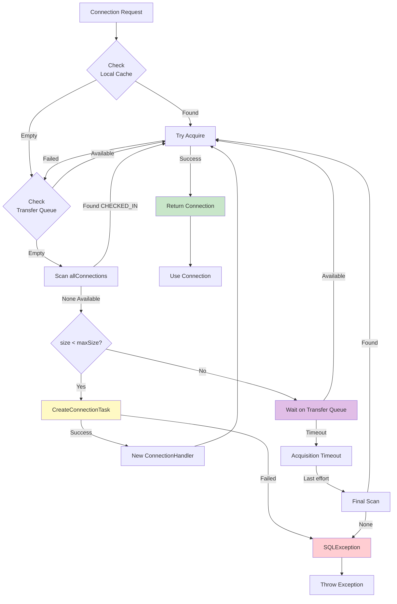
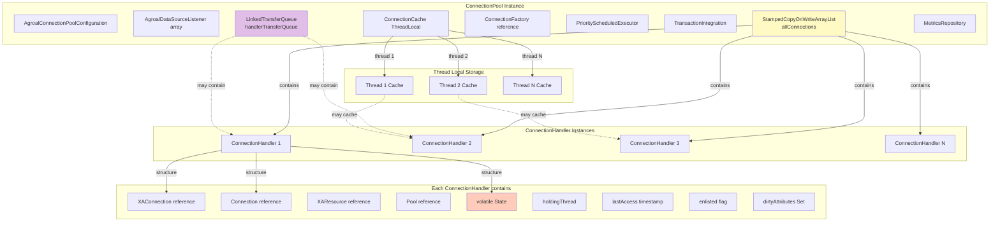
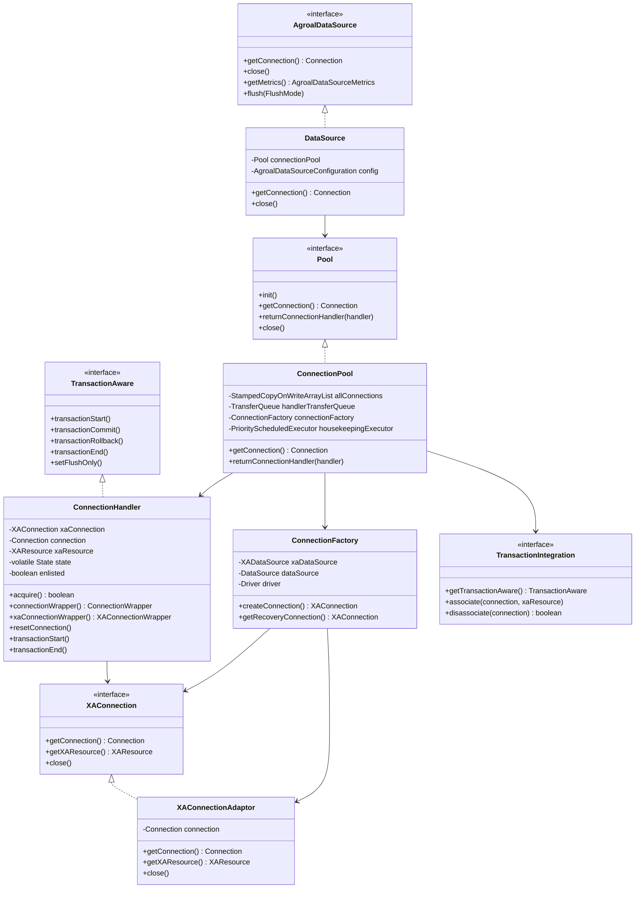

# Agroal Architecture Diagrams

This document contains detailed architectural diagrams for Agroal's XA connection pooling system.

## 1. Overall System Architecture

## 2. Connection Creation Flow

## 3. State Machine for ConnectionHandler

## 4. Thread Interaction Patterns

## 5. XA Transaction Flow with Agroal

## 6. Connection Pool Sizing Logic

## 7. Housekeeping Tasks Timeline

```mermaid
gantt
    title Agroal Housekeeping Tasks
    dateFormat X
    axisFormat %S
    
    section Leak Detection
    LeakTask runs every N seconds :active, leak1, 0, 30
    Check each connection for leak :leak2, 30, 31
    LeakTask runs again :leak3, 60, 90
    
    section Validation
    ValidationTask runs every M seconds :active, val1, 0, 45
    Validate idle connections :val2, 45, 47
    ValidationTask runs again :val3, 90, 135
    
    section Reaping
    ReapTask runs every R seconds :active, reap1, 0, 60
    Reap idle connections > minSize :reap2, 60, 62
    ReapTask runs again :reap3, 120, 180
    
    section Creation
    CreateConnectionTask (on-demand) :crit, create1, 5, 6
    CreateConnectionTask (fill to min) :crit, create2, 65, 66
    
    section Destruction
    DestroyConnectionTask :destroy1, 62, 63
    DestroyConnectionTask :destroy2, 125, 126
```

## 8. Memory Layout and Data Structures

## 9. Class Hierarchy

## 10. Comparison: Connection Acquisition Patterns

```mermaid
graph TB
    subgraph "HikariCP (Non-XA only)"
        H_APP[Application] -->|getConnection| H_DS[HikariDataSource]
        H_DS -->|borrow from| H_BAG[ConcurrentBag]
        H_BAG -->|manages| H_PROXY[ProxyConnection]
        H_PROXY -->|wraps| H_JDBC[JDBC Connection]
        H_JDBC -->|from| H_DRIVER[Driver/DataSource]
    end
    
    subgraph "Agroal (XA + Non-XA)"
        A_APP[Application] -->|getConnection| A_DS[AgroalDataSource]
        A_DS -->|delegates to| A_POOL[ConnectionPool]
        A_POOL -->|from queue| A_TRANSFER[TransferQueue]
        A_POOL -->|or scan| A_ALL[allConnections List]
        A_ALL -->|contains| A_HANDLER[ConnectionHandler]
        A_HANDLER -->|wraps| A_XA[XAConnection]
        A_XA -->|from| A_PROVIDER[XADataSource/Driver]
        
        A_POOL -.->|integrates| A_TM[Transaction Manager]
        A_TM -.->|uses| A_XARES[XAResource]
        A_XA -->|provides| A_XARES
    end
    
    style H_BAG fill:#e3f2fd
    style A_TRANSFER fill:#e3f2fd
    style A_TM fill:#e8f5e9
    style A_XARES fill:#e8f5e9
```

---

**These diagrams visualize the architecture described in** `XA_POOLING_ANALYSIS.md`

**Rendering**: Use any Mermaid-compatible viewer or renderer:
- GitHub (native support)
- Mermaid Live Editor: https://mermaid.live/
- VS Code with Mermaid extension
- IntelliJ with Mermaid plugin
