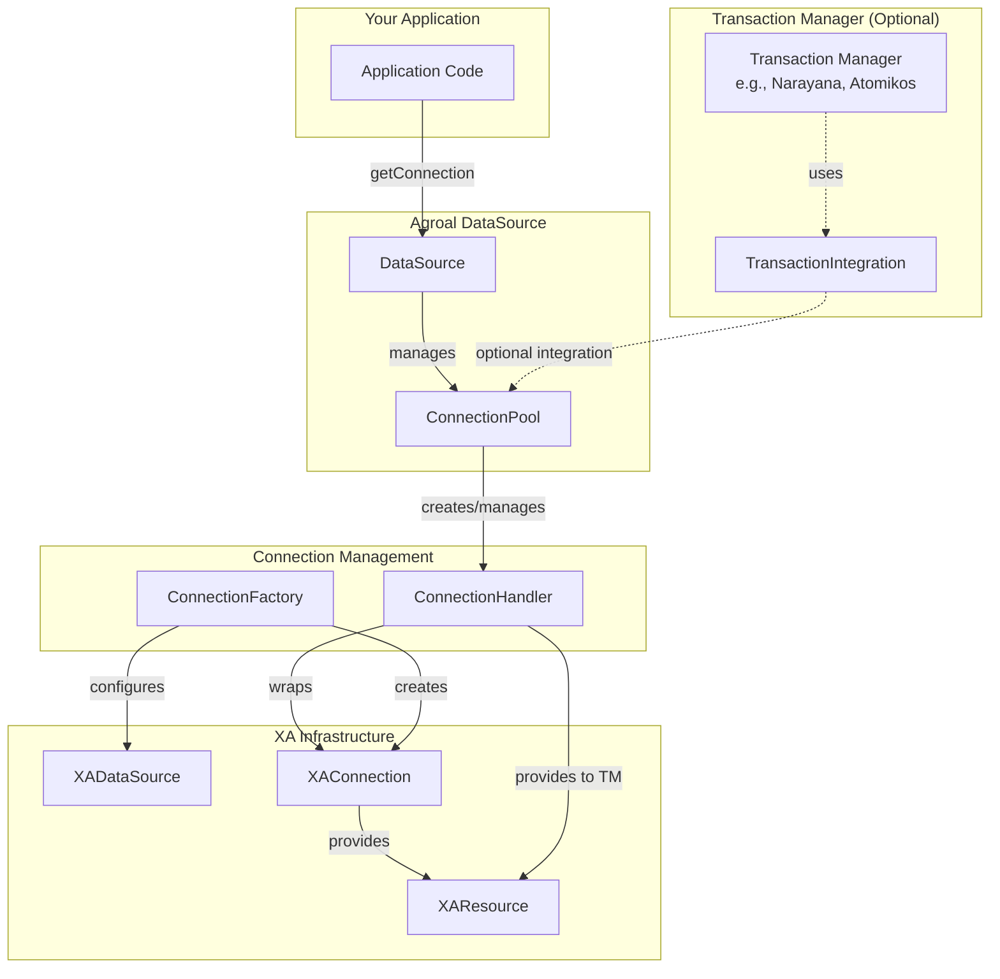
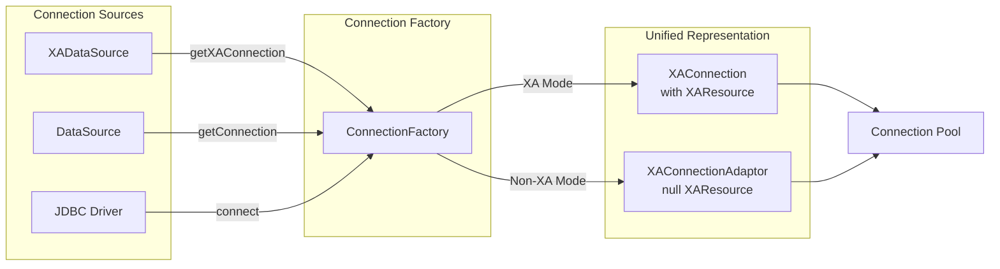
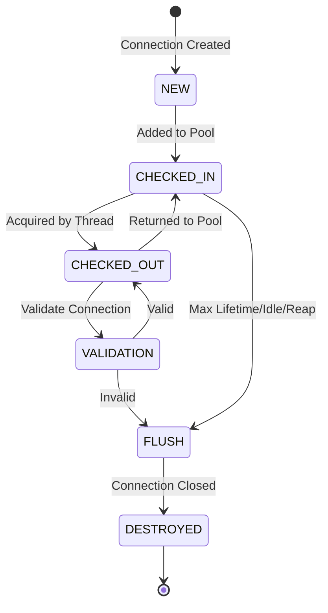
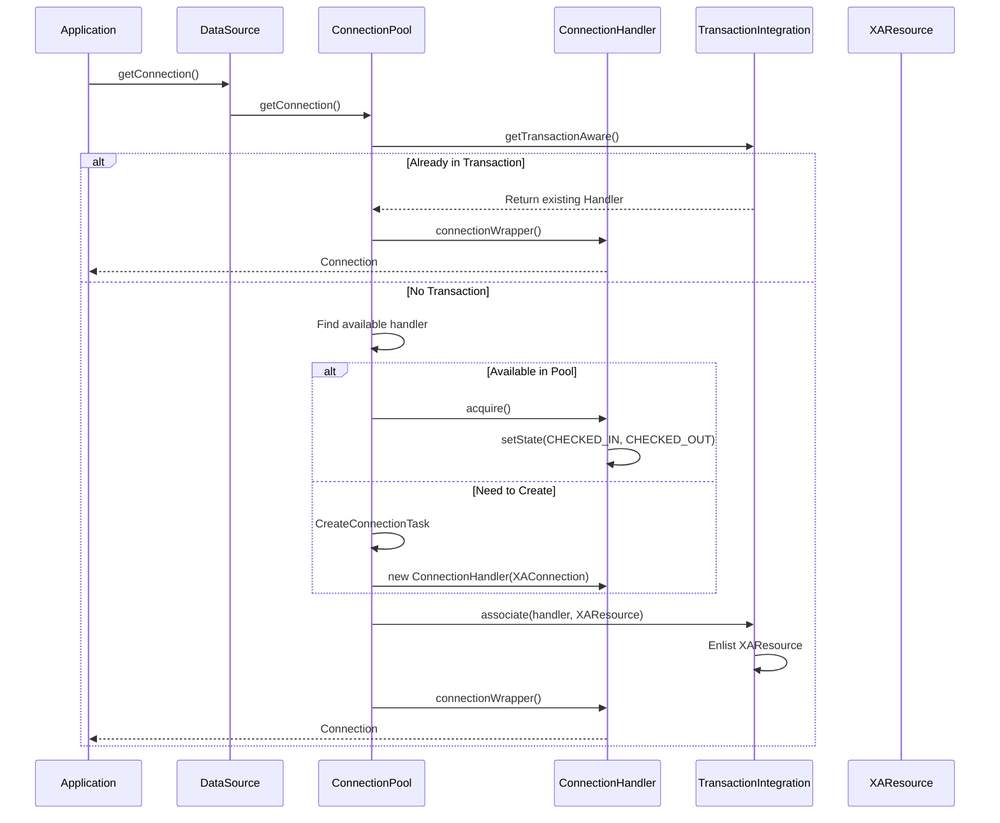
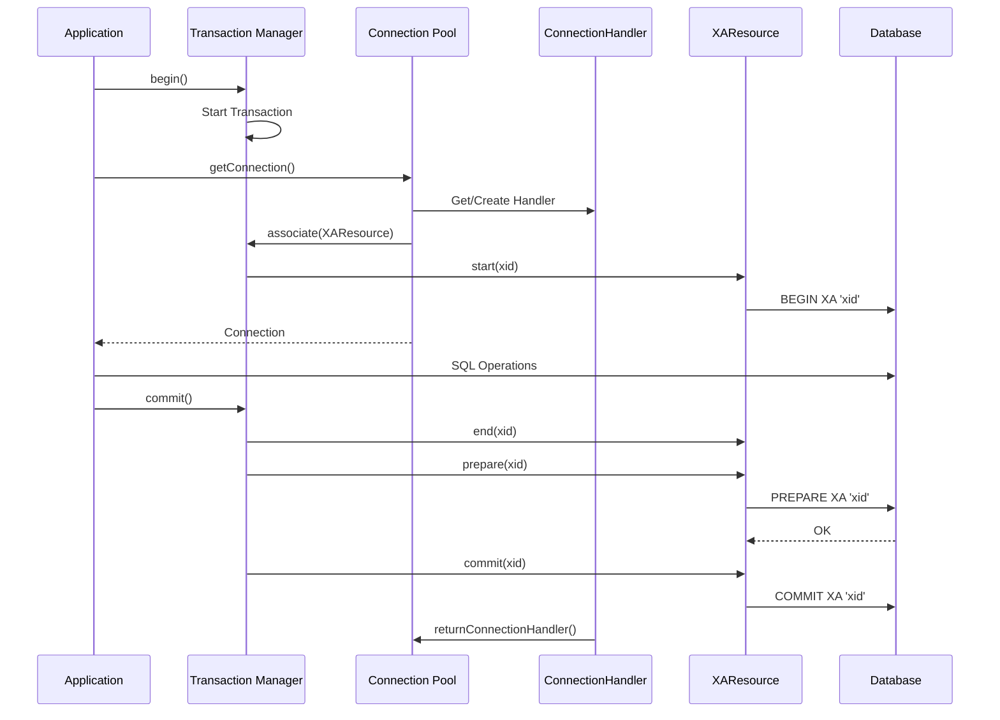
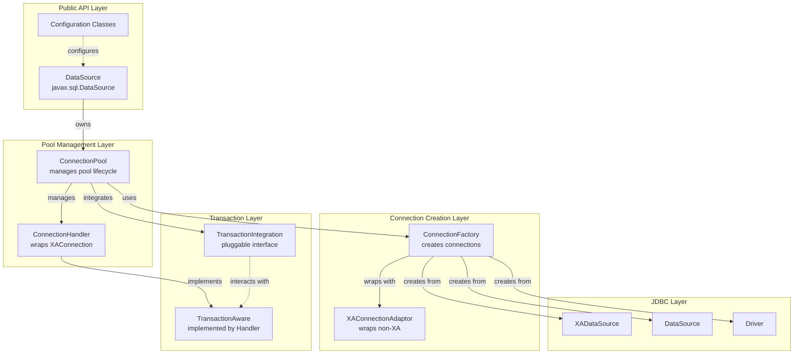

# Agroal XA Connection Pooling - Comprehensive Analysis

## Executive Summary

**Can you use Agroal's XA connection pooling in isolation?**

**YES**, Agroal can be used as a standalone XA connection pool by importing the Agroal JAR files. Agroal is specifically designed to handle both XA and non-XA connections through a unified pooling mechanism.

**Key Points:**
- ✅ Agroal supports XA connections natively through `javax.sql.XADataSource`
- ✅ You can use Agroal by simply adding dependencies to your project
- ✅ Agroal's architecture separates pooling logic from transaction management
- ✅ Minimal configuration required for XA connection pooling
- ⚠️ For full XA transaction support, you'll need a transaction manager (e.g., Narayana)

## Table of Contents

1. [Introduction](#introduction)
2. [Architecture Overview](#architecture-overview)
3. [How Agroal XA Pooling Works](#how-agroal-xa-pooling-works)
4. [Core Components](#core-components)
5. [Usage Guide](#usage-guide)
6. [Minimal Class Set for XA Pooling](#minimal-class-set-for-xa-pooling)
7. [Comparison with HikariCP](#comparison-with-hikaricp)
8. [Conclusion](#conclusion)

---

## Introduction

Agroal is a modern JDBC connection pool designed and implemented by Red Hat. Unlike traditional connection pools, Agroal was built from the ground up to handle both XA (distributed transactions) and non-XA connections efficiently through a unified architecture.

### Key Features
- **Native XA Support**: First-class support for `XAConnection` and `XAResource`
- **Unified Pooling**: Both XA and non-XA connections are pooled using the same mechanism
- **Transaction Integration**: Pluggable transaction manager integration
- **Modern Design**: Built with Java 17+, using modern concurrency primitives
- **Zero Dependencies**: Core pool has minimal dependencies

---

## Architecture Overview

Agroal's architecture is modular and consists of three main modules:

```
agroal-parent/
├── agroal-api/          # Public API and configuration interfaces
├── agroal-pool/         # Core pooling implementation
└── agroal-narayana/     # Optional: Narayana transaction manager integration
```

### High-Level Architecture Diagram



---

## How Agroal XA Pooling Works

### 1. Unified Connection Handling

Agroal treats all connections uniformly by wrapping them in `XAConnection` objects:

- **XA Connections**: Directly obtained from `XADataSource.getXAConnection()`
- **Non-XA Connections**: Wrapped in `XAConnectionAdaptor` (a null XAResource wrapper)

This design allows the same pooling logic to handle both connection types.



### 2. Connection Lifecycle



**State Descriptions:**
- **NEW**: Connection just created, not yet in pool
- **CHECKED_IN**: Available in the pool for acquisition
- **CHECKED_OUT**: Currently in use by application thread
- **VALIDATION**: Being validated for connectivity
- **FLUSH**: Marked for removal from pool
- **DESTROYED**: Connection closed and resources released

### 3. Connection Acquisition Flow



### 4. XA Transaction Integration



---

## Core Components

### 1. DataSource

**Purpose**: Entry point for obtaining connections. Implements `javax.sql.DataSource`.

**Key Responsibilities**:
- Manages the connection pool lifecycle
- Delegates connection requests to the pool
- Provides metrics and management operations

**Location**: `io.agroal.pool.DataSource`

### 2. ConnectionPool

**Purpose**: Core pooling logic managing the lifecycle of connections.

**Key Responsibilities**:
- Connection acquisition and return
- Pool sizing (min/max connections)
- Connection validation (on borrow, idle)
- Leak detection and connection reaping
- Housekeeping tasks (scheduled maintenance)

**Key Data Structures**:
```java
// All connections in the pool
StampedCopyOnWriteArrayList<ConnectionHandler> allConnections;

// Queue for transferring available connections to waiting threads
TransferQueue<ConnectionHandler> handlerTransferQueue;

// Factory for creating new connections
ConnectionFactory connectionFactory;

// Integration with transaction manager
TransactionIntegration transactionIntegration;
```

**Location**: `io.agroal.pool.ConnectionPool`

### 3. ConnectionHandler

**Purpose**: Wrapper around `XAConnection` that maintains state and provides pool management.

**Key Responsibilities**:
- State management (CHECKED_IN, CHECKED_OUT, etc.)
- Connection validation
- Transaction state tracking
- Thread tracking for leak detection
- Connection reset on return

**Key Fields**:
```java
private final XAConnection xaConnection;      // The underlying XA connection
private final Connection connection;           // Single Connection from getConnection()
private final XAResource xaResource;           // XAResource for transaction management
private volatile State state;                  // Current state
private boolean enlisted;                      // Transaction enlistment flag
```

**Location**: `io.agroal.pool.ConnectionHandler`

### 4. ConnectionFactory

**Purpose**: Creates and configures connections from various sources.

**Key Responsibilities**:
- Support multiple connection sources (XADataSource, DataSource, Driver)
- Configure connection properties
- Setup security credentials
- Provide recovery connections

**Connection Modes**:
```java
enum Mode {
    DRIVER,        // java.sql.Driver (wrapped in XAConnectionAdaptor)
    DATASOURCE,    // javax.sql.DataSource (wrapped in XAConnectionAdaptor)
    XA_DATASOURCE  // javax.sql.XADataSource (native XA)
}
```

**Location**: `io.agroal.pool.ConnectionFactory`

### 5. XAConnectionAdaptor

**Purpose**: Adapter to treat non-XA connections as XA connections.

**Key Responsibilities**:
- Wraps `java.sql.Connection` to implement `XAConnection`
- Returns null for `getXAResource()` (no XA support)
- Allows unified handling in the pool

**Location**: `io.agroal.pool.util.XAConnectionAdaptor`

### 6. TransactionIntegration

**Purpose**: Interface for pluggable transaction manager integration.

**Key Responsibilities**:
- Associate connections with transactions
- Enlist XAResources with transaction manager
- Return connections at transaction end
- Provide recovery connections

**Default Implementation**: `TransactionIntegration.none()` - No-op implementation

**Location**: `io.agroal.api.transaction.TransactionIntegration`

### Component Interaction Diagram



---

## Usage Guide

### Prerequisites

Add Agroal dependencies to your project:

**Maven:**
```xml
<dependency>
    <groupId>io.agroal</groupId>
    <artifactId>agroal-api</artifactId>
    <version>3.0</version>
</dependency>
<dependency>
    <groupId>io.agroal</groupId>
    <artifactId>agroal-pool</artifactId>
    <version>3.0</version>
</dependency>
```

**Gradle:**
```gradle
implementation 'io.agroal:agroal-api:3.0'
implementation 'io.agroal:agroal-pool:3.0'
```

### Example 1: Basic XA Connection Pool (Without Transaction Manager)

```java
import io.agroal.api.AgroalDataSource;
import io.agroal.api.configuration.supplier.AgroalDataSourceConfigurationSupplier;
import javax.sql.XAConnection;
import javax.transaction.xa.XAResource;
import java.sql.Connection;

public class BasicXAPoolExample {
    
    public static void main(String[] args) throws Exception {
        // Configure the pool for XA DataSource
        AgroalDataSourceConfigurationSupplier configuration = 
            new AgroalDataSourceConfigurationSupplier()
                .connectionPoolConfiguration(cp -> cp
                    .initialSize(5)
                    .minSize(5)
                    .maxSize(20)
                    .connectionFactoryConfiguration(cf -> cf
                        .connectionProviderClass(com.example.MyXADataSource.class)
                        .jdbcUrl("jdbc:postgresql://localhost:5432/mydb")
                        .principal(new NamePrincipal("username"))
                        .credential(new SimplePassword("password"))
                    )
                );
        
        // Create the data source
        try (AgroalDataSource dataSource = AgroalDataSource.from(configuration)) {
            
            // Get a connection - Agroal handles pooling
            try (Connection connection = dataSource.getConnection()) {
                // Use connection for regular JDBC operations
                var stmt = connection.createStatement();
                var rs = stmt.executeQuery("SELECT * FROM users");
                // ... process results
            }
            
            // If you need direct access to XAConnection (advanced use)
            // You would need to unwrap from ConnectionWrapper
            // Or use the pool's getRecoveryConnection() method
        }
    }
}
```

### Example 2: XA Connection Pool with Manual Transaction Management

```java
import io.agroal.api.AgroalDataSource;
import io.agroal.api.configuration.supplier.AgroalDataSourceConfigurationSupplier;
import javax.sql.XAConnection;
import javax.transaction.xa.XAResource;
import javax.transaction.xa.Xid;

public class ManualXATransactionExample {
    
    public void performDistributedTransaction() throws Exception {
        AgroalDataSourceConfigurationSupplier config = 
            new AgroalDataSourceConfigurationSupplier()
                .connectionPoolConfiguration(cp -> cp
                    .maxSize(10)
                    .connectionFactoryConfiguration(cf -> cf
                        .connectionProviderClass(MyXADataSource.class)
                        .jdbcUrl("jdbc:postgresql://localhost:5432/db1")
                    )
                );
        
        try (AgroalDataSource ds = AgroalDataSource.from(config)) {
            
            // Access the underlying pool to get XAConnection
            // Note: This is advanced usage - normally use with a TM
            ConnectionPool pool = (ConnectionPool) ((DataSource) ds).connectionPool;
            XAConnection xaConn = pool.getRecoveryConnection();
            
            try {
                XAResource xaRes = xaConn.getXAResource();
                Connection conn = xaConn.getConnection();
                
                // Create and start XA transaction
                Xid xid = createXid();
                xaRes.start(xid, XAResource.TMNOFLAGS);
                
                // Perform database operations
                var stmt = conn.createStatement();
                stmt.executeUpdate("UPDATE accounts SET balance = balance - 100 WHERE id = 1");
                
                // End and prepare
                xaRes.end(xid, XAResource.TMSUCCESS);
                int result = xaRes.prepare(xid);
                
                // Commit
                if (result == XAResource.XA_OK) {
                    xaRes.commit(xid, false);
                }
                
            } finally {
                xaConn.close(); // Returns to pool
            }
        }
    }
    
    private Xid createXid() {
        // Implementation to create XID
        // ...
    }
}
```

### Example 3: Using with Narayana Transaction Manager

```java
import io.agroal.api.AgroalDataSource;
import io.agroal.api.configuration.supplier.AgroalDataSourceConfigurationSupplier;
import io.agroal.narayana.NarayanaTransactionIntegration;
import com.arjuna.ats.jta.TransactionManager;

public class NarayanaIntegrationExample {
    
    public static void main(String[] args) throws Exception {
        // Get Narayana transaction manager
        javax.transaction.TransactionManager tm = 
            TransactionManager.transactionManager();
        
        // Configure Agroal with Narayana integration
        AgroalDataSourceConfigurationSupplier configuration = 
            new AgroalDataSourceConfigurationSupplier()
                .connectionPoolConfiguration(cp -> cp
                    .maxSize(20)
                    .transactionIntegration(
                        new NarayanaTransactionIntegration(tm)
                    )
                    .connectionFactoryConfiguration(cf -> cf
                        .connectionProviderClass(MyXADataSource.class)
                        .jdbcUrl("jdbc:postgresql://localhost:5432/mydb")
                    )
                );
        
        try (AgroalDataSource dataSource = AgroalDataSource.from(configuration)) {
            
            // Begin transaction
            tm.begin();
            
            try {
                // Get connection - automatically enlisted in transaction
                try (Connection conn = dataSource.getConnection()) {
                    var stmt = conn.createStatement();
                    stmt.executeUpdate("INSERT INTO orders VALUES (1, 'Product A')");
                }
                
                // Get another connection - reuses same connection in transaction
                try (Connection conn = dataSource.getConnection()) {
                    var stmt = conn.createStatement();
                    stmt.executeUpdate("UPDATE inventory SET qty = qty - 1");
                }
                
                // Commit - Agroal handles XA prepare/commit
                tm.commit();
                
            } catch (Exception e) {
                tm.rollback();
                throw e;
            }
        }
    }
}
```

### Example 4: Configuration for Your Database Proxy

Since you mentioned you have a database proxy using JDBC and you use HikariCP for non-XA connections:

```java
import io.agroal.api.AgroalDataSource;
import io.agroal.api.configuration.supplier.AgroalDataSourceConfigurationSupplier;

public class DatabaseProxyXAPool {
    
    private final AgroalDataSource xaPool;
    private final HikariDataSource nonXaPool; // Your existing HikariCP pool
    
    public DatabaseProxyXAPool() throws Exception {
        // Setup Agroal for XA connections
        AgroalDataSourceConfigurationSupplier xaConfig = 
            new AgroalDataSourceConfigurationSupplier()
                .connectionPoolConfiguration(cp -> cp
                    .initialSize(10)
                    .minSize(10)
                    .maxSize(50)
                    .acquisitionTimeout(Duration.ofSeconds(30))
                    .leakTimeout(Duration.ofMinutes(5))
                    .validationTimeout(Duration.ofMinutes(1))
                    .reapTimeout(Duration.ofMinutes(10))
                    .connectionFactoryConfiguration(cf -> cf
                        .connectionProviderClass(YourXADataSourceClass.class)
                        .jdbcUrl("jdbc:yourdb://host:port/database")
                        // XA specific properties
                        .jdbcProperty("xaProperty1", "value1")
                    )
                );
        
        this.xaPool = AgroalDataSource.from(xaConfig);
        
        // Keep your existing HikariCP for non-XA
        // this.nonXaPool = ... (existing setup)
    }
    
    public Connection getXAConnection() throws SQLException {
        return xaPool.getConnection();
    }
    
    public Connection getNonXAConnection() throws SQLException {
        return nonXaPool.getConnection();
    }
    
    public XAConnection getXAConnectionForTM() throws SQLException {
        // For direct XA access by transaction manager
        // You'll need to access the pool internals or use recovery connection
        ConnectionPool pool = getPoolReference();
        return pool.getRecoveryConnection();
    }
    
    public void close() {
        if (xaPool != null) {
            xaPool.close();
        }
        if (nonXaPool != null) {
            nonXaPool.close();
        }
    }
}
```

---

## Minimal Class Set for XA Pooling

If you wanted to copy/extract just the XA pooling functionality from Agroal, here are the essential classes:

### Core Classes (Must Have)

1. **io.agroal.pool.ConnectionPool**
   - The main pooling logic
   - ~900 lines
   - Manages connection lifecycle, acquisition, return

2. **io.agroal.pool.ConnectionHandler**
   - Wraps XAConnection with state management
   - ~430 lines
   - Handles state transitions, validation, transactions

3. **io.agroal.pool.ConnectionFactory**
   - Creates connections from various sources
   - ~320 lines
   - Supports XADataSource, DataSource, Driver

4. **io.agroal.pool.DataSource**
   - Entry point implementing javax.sql.DataSource
   - ~140 lines
   - Simple facade over ConnectionPool

5. **io.agroal.pool.Pool** (Interface)
   - ~60 lines
   - Contract for pool implementations

### Wrapper Classes (Must Have)

6. **io.agroal.pool.wrapper.ConnectionWrapper**
   - Wraps Connection for pool management
   - Intercepts close() to return to pool

7. **io.agroal.pool.wrapper.XAConnectionWrapper**
   - Wraps XAConnection for pool management
   - ~140 lines

8. **io.agroal.pool.wrapper.XAResourceWrapper**
   - Wraps XAResource for tracking
   - ~130 lines

9. **io.agroal.pool.util.XAConnectionAdaptor**
   - Adapts non-XA connections to XAConnection interface
   - ~60 lines

### Utility Classes (Must Have)

10. **io.agroal.pool.util.PriorityScheduledExecutor**
    - For housekeeping tasks (validation, leak detection, reaping)

11. **io.agroal.pool.util.StampedCopyOnWriteArrayList**
    - Lock-free list for connection storage

12. **io.agroal.pool.util.PropertyInjector**
    - For setting DataSource properties via reflection

13. **io.agroal.pool.MetricsRepository**
    - For collecting pool metrics (optional but useful)

### Configuration Classes (Must Have)

From `agroal-api` module:

14. **io.agroal.api.configuration.AgroalDataSourceConfiguration**
15. **io.agroal.api.configuration.AgroalConnectionPoolConfiguration**
16. **io.agroal.api.configuration.AgroalConnectionFactoryConfiguration**
17. **io.agroal.api.configuration.supplier.*** (Configuration builders)

### Transaction Integration (Optional but Recommended)

18. **io.agroal.api.transaction.TransactionIntegration** (Interface)
    - Allows plugging in a transaction manager
    - Default no-op implementation available

19. **io.agroal.api.transaction.TransactionAware** (Interface)
    - Implemented by ConnectionHandler

### Supporting Interfaces

20. **io.agroal.api.AgroalDataSource** (Interface)
21. **io.agroal.api.AgroalDataSourceListener** (Interface)
22. **io.agroal.api.cache.ConnectionCache** (Interface)

### Approximate Total

- **Core Logic**: ~2,500 lines
- **Configuration**: ~1,000 lines  
- **Utilities**: ~500 lines
- **Interfaces**: ~300 lines

**Total: ~4,300 lines** (excluding comments and blanks)

### Dependency Tree

```
agroal-pool (Core Implementation)
    └── agroal-api (Interfaces & Configuration)
        └── jboss-transaction-spi (only for TransactionManager interface)
            └── No other dependencies for core functionality
```

---

## Comparison with HikariCP

| Feature | Agroal | HikariCP |
|---------|--------|----------|
| **XA Support** | ✅ Native, first-class | ❌ No native support |
| **Connection Type** | Unified XA/Non-XA | Non-XA only |
| **Transaction Integration** | Pluggable (Narayana, etc.) | None |
| **XAResource Management** | Built-in | Not applicable |
| **Transaction Recovery** | Supported | Not applicable |
| **Pool Algorithm** | Transfer queue based | FastList + ConcurrentBag |
| **Performance** | Excellent | Excellent |
| **Metrics** | Built-in | Built-in |
| **Maturity** | Mature (Red Hat backed) | Very mature |
| **Use Case** | XA + Non-XA | Non-XA only |

### When to Use Agroal Over HikariCP

1. **You need XA/distributed transactions**
   - Agroal is designed for this
   - HikariCP cannot handle XA connections

2. **You're using a Java EE/Jakarta EE container**
   - Agroal integrates well with JTA
   - Used by WildFly/Quarkus

3. **You need transaction recovery**
   - Agroal supports XA recovery
   - Critical for crash recovery in distributed systems

4. **You want unified pool management**
   - Single pool for both XA and non-XA
   - Simplifies operations

### When to Keep HikariCP

1. **You only need non-XA connections**
   - HikariCP is simpler for this use case
   - Slightly less overhead

2. **You're already using it successfully**
   - If it's working, migration cost may not be worth it
   - Unless you need XA functionality

---

## Conclusion

### Answering Your Questions

**1. Can you use only the XA connection pooling of Agroal in isolation?**

**YES**. You can use Agroal as a standalone XA connection pool by:
- Adding `agroal-api` and `agroal-pool` JARs to your project
- Configuring it to use your `XADataSource`
- Using it just like any other connection pool

**2. Which classes manage the pooling?**

The core classes are:
- **ConnectionPool**: Main pool logic
- **ConnectionHandler**: Connection state management  
- **ConnectionFactory**: Connection creation
- **DataSource**: Public API entry point

**3. Could you copy them over to manage pooling?**

Yes, but **not recommended** because:
- ~4,300 lines of code with intricate interactions
- Multiple utility classes and careful concurrency handling
- Configuration system tightly integrated
- **Better approach**: Use Agroal as a library dependency

**4. How does Agroal connection pooling work?**

See the diagrams and explanations above. Key points:
- All connections are wrapped as XAConnection (even non-XA ones)
- State machine manages connection lifecycle
- Transfer queue for efficient thread-to-thread handoff
- Housekeeping executor for background maintenance
- Optional transaction manager integration

### Recommendation

**For your database proxy project:**

1. **Keep HikariCP** for non-XA connection pooling (it works well)

2. **Add Agroal** for XA connection pooling:
   ```java
   // Your proxy
   class DatabaseProxy {
       private HikariDataSource nonXaPool;  // existing
       private AgroalDataSource xaPool;      // new
       
       Connection getConnection(boolean requiresXA) {
           return requiresXA ? xaPool.getConnection() 
                            : nonXaPool.getConnection();
       }
   }
   ```

3. **Benefits**:
   - Use the right tool for each job
   - Minimal code changes
   - Leverage both pools' strengths
   - No need to maintain custom pool code

4. **If you need full XA transaction support**:
   - Add a transaction manager (Narayana, Atomikos)
   - Integrate it with Agroal using TransactionIntegration
   - See Example 3 above

### Further Resources

- **Agroal GitHub**: https://github.com/agroal/agroal
- **Agroal Website**: https://agroal.github.io/
- **Narayana Integration**: `agroal-narayana` module
- **Quarkus Integration**: Quarkus uses Agroal by default

### Getting Started

```bash
# Add to Maven
<dependency>
    <groupId>io.agroal</groupId>
    <artifactId>agroal-pool</artifactId>
    <version>3.0</version>
</dependency>

# For Narayana integration
<dependency>
    <groupId>io.agroal</groupId>
    <artifactId>agroal-narayana</artifactId>
    <version>3.0</version>
</dependency>
```

---

## Appendix: Key Design Patterns in Agroal

### 1. State Pattern
`ConnectionHandler` uses explicit state management (State enum) for connection lifecycle.

### 2. Adapter Pattern
`XAConnectionAdaptor` adapts non-XA connections to the XAConnection interface.

### 3. Factory Pattern
`ConnectionFactory` creates connections from different sources (XADataSource, DataSource, Driver).

### 4. Strategy Pattern
`TransactionIntegration` is a pluggable strategy for transaction management.

### 5. Wrapper/Decorator Pattern
`ConnectionWrapper`, `XAConnectionWrapper`, `XAResourceWrapper` intercept calls for pool management.

### 6. Transfer Queue Pattern
Uses `LinkedTransferQueue` for efficient thread-to-thread connection handoff without blocking.

---

**Document Version**: 1.0  
**Date**: January 2026  
**Agroal Version Analyzed**: 3.0-SNAPSHOT  
